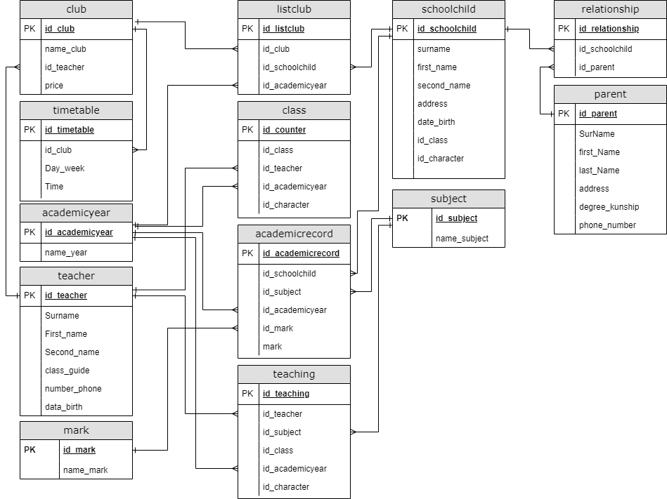
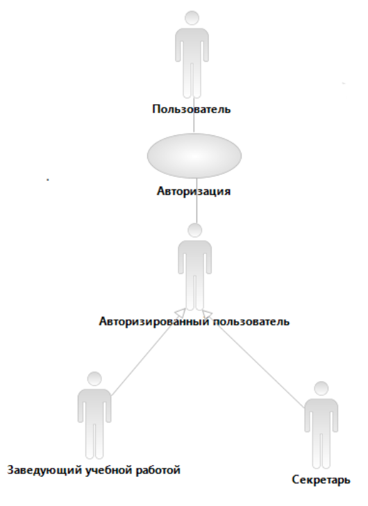
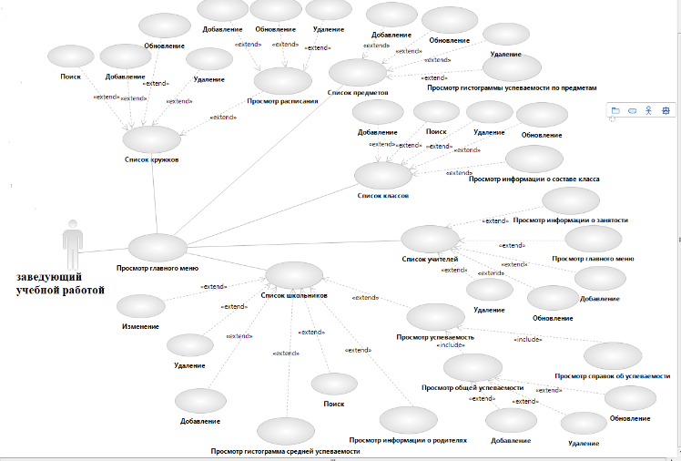
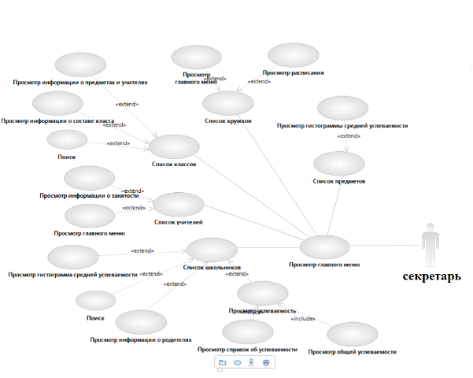

# :mortar_board: База данных "Школа"

 

:exclamation: Реализация системы была представлена в рамках выполнения учебного курсового проекта в 2022 году.

Целью создания **базы данных «Школа»** является построение информационной системы, позволяющей администрации школы хранить, добавлять, изменять, удалять, получать требуемые данные об учебном процессе: о школьниках, об учителях, о предметах, о кружках и классах.

## 1. Назначение системы

Для выполнения рабочих обязанностей секретаря: поиска, вывода справочной информации. 
Для заведующего учебной работой: поиска, добавления, удаления, изменения данных, вывода справочной информации.

## 2. Сборка проекта

>  sudo docker-compose up -d

Команда, которую необходимо ввести в текущей директории (**./**) для сборки и запуска.

Для входа в phpmyadmin в строке браузера требуется ввести *http://localhost:8001/* и *enter*. Для перехода к пользовательскому интерфейсу: *http://localhost/Authorization.php* и *Enter*.

## 3. Требования к системе

Выходные документы:
- Справка об успеваемости;
- Списки участников дополнительных занятий (кружков).

Бизнес-правила, которые накладывают ограничения:
- В школе по всем классам несколько параллелей;
- Один предмет может изучаться в течение нескольких лет. В разных классах разные наборы предметов;
- Ученик не может оставаться на повторное обучение;
- Экзамены сдаются в 9 и 11 классах, но не по всем предметам.
- Итоговая оценка совпадает с годовой или вычисляется как среднее между годовой и экзаменационной (с округлением в большую сторону);
- Ученик может принимать участие в любом количестве кружков, но по времени пересечений быть не должно.

## 3. База данных

:exclamation: В папке **database** проекта реализованы sql-запросы базы данных для ее создания и наполнения для демонстрации функционирования системы.

В соответствии с требованиями и бизнес-правилами были выявлены следующие сущности:
-	Школьник (Код школьника, фамилия, имя, отчество, адрес, дата рождения, номер класса, буква класса);
-	Успеваемость (Код школьника, код предмета, код успеваемости, код учебного года, код наименования оценки, оценка);
-	Учебный год (Код учебного года, название учебного года);
- Класс (Код класса, номер класса, код учителя, код учебного года, буква класса);
- Кружок (Код кружка, название кружка, код кружка, цена);
- Список кружков (Код кружка, код школьника, код состава кружка, код учебного года);
- Оценка (Код наименования оценки, наименование оценки);
- Родитель (Код родителя, фамилия, имя, отчество, адрес, степень родства, номер телефона);
- Отношения (Код отношений, код школьника, код родитель);
- Предметы (Код предмета, название предмета);
- Учителя (Код учитель, фамилия, имя, отчество, классное руководство, номер телефона, дата рождения);
- Преподавания (Код учитель, код предмет, код номер класса, код преподавания, код учебный год, буква класса);
- Расписание кружка (Код расписания кружка, код кружка, день недели, время);

А также сущность Авторизация (Код авторизации, пользователь, пароль).

 Структура базы данных Школа 

 

## 4. uml-диаграммы прецендентов

 UML-диаграмма прецендентов часть 1 

 

 UML-диаграмма прецендентов часть 2 

 

 UML-диаграмма прецендентов часть 3 

## 5. Дополнительно

Изображения (./materials/images/), использованные в проекте, были взяты в сайта: icon-icons.com